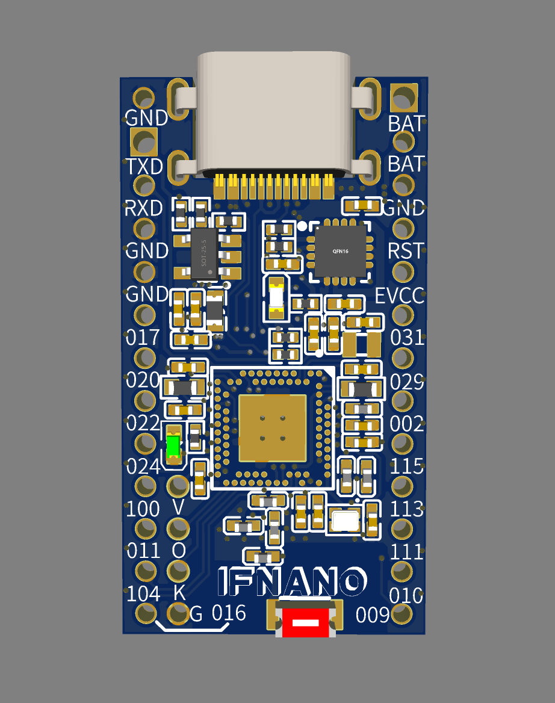

#### IF-NANO

#### Introduction
One is suitable for zmk, and the software and hardware are compatible with nice!nano's main control.
IFNANO mainly refers to nice! Nano's design is re-layouted as a double-sided board, and a switch function and an ipx antenna socket (1st generation) are added, which reduces production costs and improves practicability.
At present, the basic functions have been tested and can be used normally.

#### Circuit Design
For details, please see the Schematic_IFNANOV5_2022-08-10.pdf file, which is basically a nice clone! Nano original design.
Bootloader can use nice directly! The nano file, the test uses nice_nano_bootloader-0.6.0_s140_6.1.1.hex, has been attached.

#### Soldering Tutorial
Due to space reasons, the silkscreen of the original part is removed from the pcb, so please refer to the "Soldering Assistant" file for the specific value and position of the original part.
The "Welding Assistant" file is essentially a web page, which needs to be opened with a browser.

#### Instructions for use

1. The LED in the upper right corner is a red LED. When the light is on, it is in the charging state. If it is not on, it is in the full state or not in the charging state (not plugged in).
2. The LED in the lower left corner is the function indicator light, which will display breathing in the BL state, and will not light up in the normal working state.
3. The extra row of four-hole interface in the lower left corner of the pcb is the SWD interface, use jlink to burn the bootloader program or erase the chip.
4. There are two antennas in this design, the front is a patch antenna (bottom, red original), and the back is an ipx generation antenna base. Please choose one of these two antennas when using them, and do not use them at the same time.
5. There is a switch designed on the back, and a 1-digit SMD DIP switch is required. (untested)
6. This design uses ti bq24057 charging chip, supports 4.2V lithium battery, and nice! Nano is the same. The chip is set in usb 500ma mode, and a resistor (R9 1.68K) is reserved to control the charging current. The actual test keeps the maximum charging current at about 430ma, accompanied by a certain amount of heat, so be careful to touch the pcb board when charging. (There is no specific test for the heating temperature. Personally, it is estimated to be about 60 degrees, and the work is stable and normal)
7. 32k crystal needs to be installed

#### References:

1. https://nicekeyboards.com/docs/nice-nano/pinout-schematic
2. https://github.com/joric/jorne/wiki

   

#### Connect:

IFKB customized QQ group

78769032

#### Author:

(QQ)463365135

(email)463365135@qq.com

